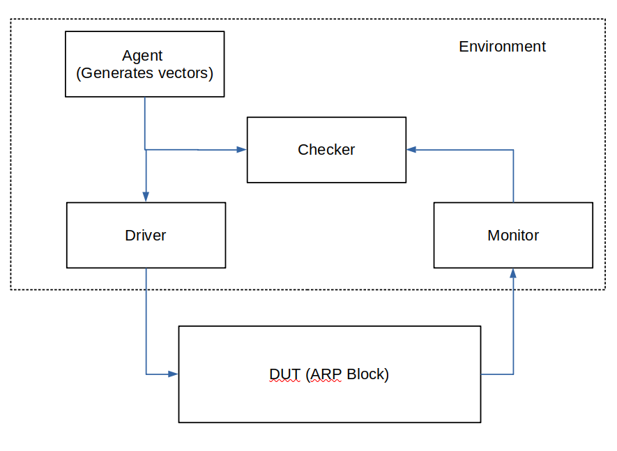
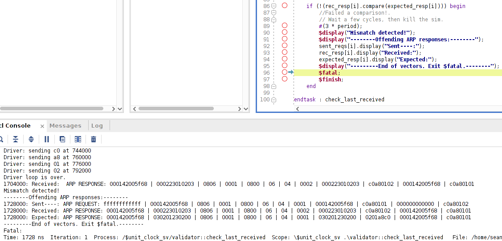
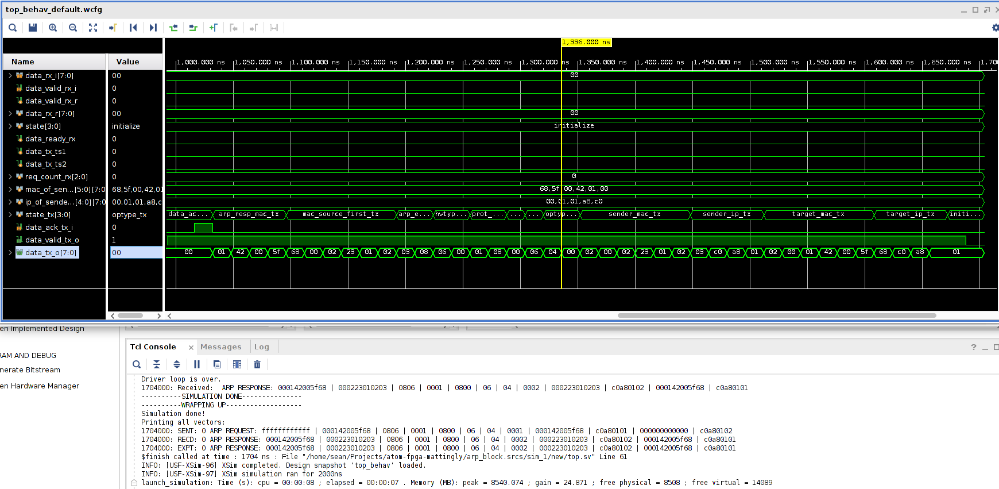

# Contents of Branch

This is a SystemVerilog implementation of a basic Address Response Protocol. Both a fairly well featured testbench and the ip block itself are included. The testbench is object oriented, and handles each 42 octet ARP request or response as a single object, allowing easy comparison of output ARP responses from the DUT to their expected (calculated) value.

This testbench, thus, is self checking and specifically uses a separate method (with regular non synthesizable SystemVerilog constructs) to generate the expected test vector.

This branch also contains a synthesizable address response protocol block in ``arp.sv``. The description of this block is below. 

# Theory of Operation -- Testbench

The testbench is based on the object oriented and portable practices given in Spear & Tumbush's *SystemVerilog for Verification*. It is not the whole testbench, but uses quite a few parts from it. The basic structure can be seen below:



The testbench uses a number of features that makes it easier to do things:

1. It uses an interface with well defined clocking blocks. This makes it very easy to just clock on these clock bocks (whether it's @clk_rx or @clk_tx) in separate parts of the testbench, as well as have the monitor assert a data_ack_tx signal when the ARP block begins its output.
2. It will break *just after* an erroneous vector is detected. This enables faster debug cycle time - an important consideration when simulations take a long time. Vivado is nice in that it opens up a waveform as well. It does wait a few cycles before officially ending the simulation - this is to let other strange effects work through if they are present.
3. It uses SystemVerilog fork...join for running the monitor and driver in parallel.
4. It uses callbacks in order to enable the environment to choose how checking is done. This enables swapping out testing functions and expected vector calculations, if needed.

Overall, the testbench is made to enable portability of its components and faster debug time. I made the testbench before starting on the ARP - test driven development, if you will.

As an example, here's an example of the testbench failing out on a failed vector where I actually got wiring backwards at one point:

 

It prints out the offending vector vs the expected vector as well. Note the received and expected vectors are formatted exactly the same for faster debugging.

And here is a successful simulation:



The testbench is made up of the following files:

```
arp_tr.sv -- Defines the ARP response and requests objects. Both inherit from and implement a virtual base class.
arp_if.sv -- Defines the interface between the testbench and the DUT. The clocking blocks are defined here.
environment.sv -- Contains the instantiation of the different testbench components - agent, checker, monitor, and driver.
monitor.sv -- Receives octets from the DUT and packages them into a ARP vector.
checker.sv -- Compares the vector received by the monitor to that driven by the driver.
driver.sv -- Takes ARP vectors and sends the octets into the DUT.
agent.sv -- Generates the vectors to simulate (just one currently).
clock.sv -- Defines a clock across the whole simulation.
```

All of this is connected to the design, in arp.sv, inside of top.sv

# Theory of Operation -- ARP Block

The ARP is located in the systemverilog file arp.sv.

This block functions, at a high level, as follows: 

1. An FSM receives the request. If the request is formatted properly, the FSM captures the IP and MAC of the sender and asserts an internal signal when that data is captured.
2. This internal assert is captured with a 2FF toggle synchronizer. The output from this toggle synchronizer is used as an enable signal on a FF to bring the ready data to the TX clock domain.
3. Another, similar FSM outputs the ARP response on the clock TX ports. It waits for an ACK signal after it outputs the first ARP response octet. Upon receipt of this signal, it sends the rest of the ARP response.

The block is currently written as a single flat systemverilog file. The data flow roughly goes in the same direction as reading it straight down. There are some exceptions, such as:

1. The state logic in some places.
2. A feedback signal from the output FSM that is AND'd into the TX clock data capture flip-flop enable port. This feedback makes sure a new ARP request won't corrupt one that's being output.

This touches on the limitations of the current block, which are addressed in next steps, below.

This design does meet timing for 125 MHz through implementation, with quite a bit of slack (about 3/8 of a period.)

# Next Steps

1. The block cannot receive another ARP request while it is processing a single one, including output. This would have to be specified in requirements. Alternatively, you could just instantiate more of them and use a mux + a busy signal to route new ARPs to other blocks. But there's also more complexity in memory for the output, etc.
2. This block only handles ARP requests and responses. There are other ethertypes out there!
3. The testbench does not yet have randomization. The first thing to randomize here is the delay for the ACK signal, starting with just 1 clock - I chose 7 arbitrarily.
4. Skew the RX and TX clocks relative to each other.
5. Insert systemverilog assertions where needed.
6. Split the FSMs into their own module definitions. Usually synthesis tools are happier with this. Currently, the arp is one flat systemverilog file.
7. There are a lot of FSM states. This could be condensed, for example, on the output FSM by having a single long output vector that the FSM outputs. This would mean it'd only need 3 or so states.

# Try It Out

There is an archived Vivado 2020.2 project included in this repo, ``arp_behav_synth_imp_simulation.xpr.zip``. It should be able to just open and run the simulation, synthesis, and implementation. Note it is just a snapshot; other code changes could happen.